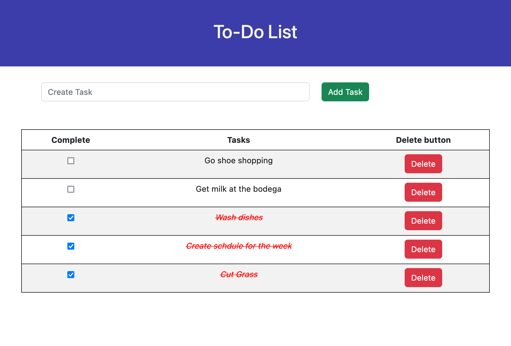
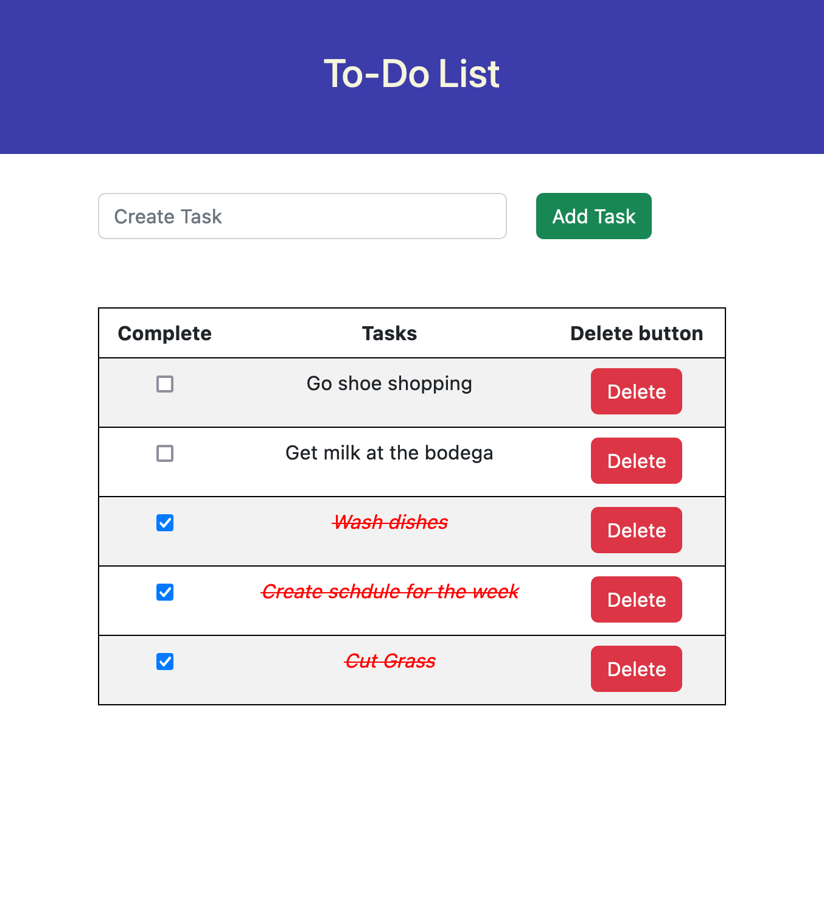
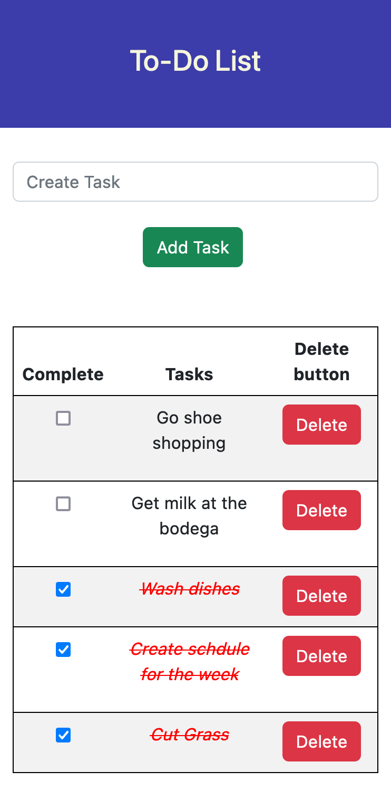
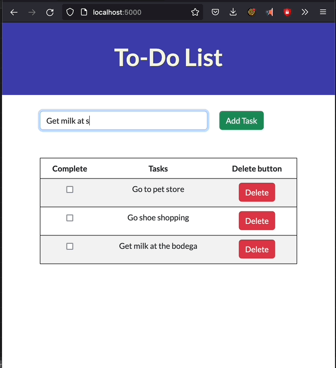

# To-Do List

## Description

_Duration: 3 day Sprint_

The To-Do List web app allows users to add a task to a list. Once the task is on the list, users can mark the task as being done or delete an item from the to-do list 

## Screen Shot

   

### Prerequisites

- [Node.js](https://nodejs.org/en/)
- Create database from to-do.sql

## Installation
run npm install

## Built With

- HTML
- CSS
- JAVASCRIPT
- JQuery
- NODE
- BOOTSTRAP
- Sweet Alerts

## License
[MIT](https://choosealicense.com/licenses/mit/)

_Note, include this only if you have a license file. GitHub will generate one for you if you want!_

## Acknowledgement
Thanks to [Prime Digital Academy](www.primeacademy.io) who equipped and helped me to make this application a reality. (Thank your people)

## Support
If you have suggestions or issues, please email me at [ALHOUSSEINEC@GMAIL.COM](www.google.com)
